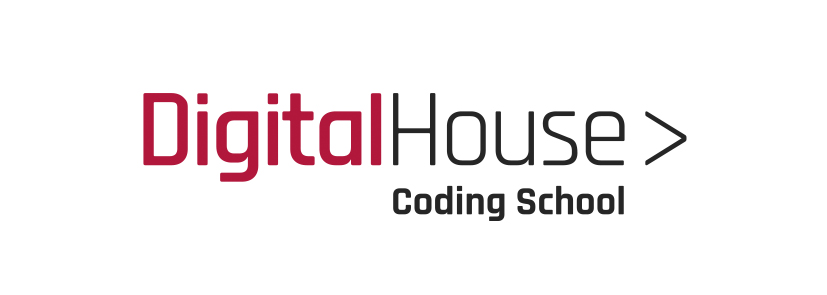

  

  

  

<h4  align="center">

  

Desenvolvimento Web Full Stack

  

</h4>

  
  
  

Link do programa e processo seletivo: [https://www.digitalhouse.com/br/santandercoders/](https://www.digitalhouse.com/br/santandercoders/)

  

Vídeo explicando o programa: [https://www.youtube.com/watch?v=_xsWtu072IA&feature=emb_logo](https://www.youtube.com/watch?v=_xsWtu072IA&feature=emb_logo)

  

Neste repositório está o conteúdo do curso separado por pastas, dentro de cada pasta contém o Readme com links e utilidades para cada modulo.

  

## :blue_book:Módulos

  

  

### [Javascript Introdução]

  

### [Metodologias Ágeis]

  

### [Node]

  

### [Html - Css]

  

### [Express]

  

### [NodeJS]

  

### [Posicionamento e Responsividade]

  

### [Bootstrap]

  

### [Flexbox]

  

---

  

  

<h5  align="center"> Web Full Stack by Lucas Zarza </h5>

  

  

---